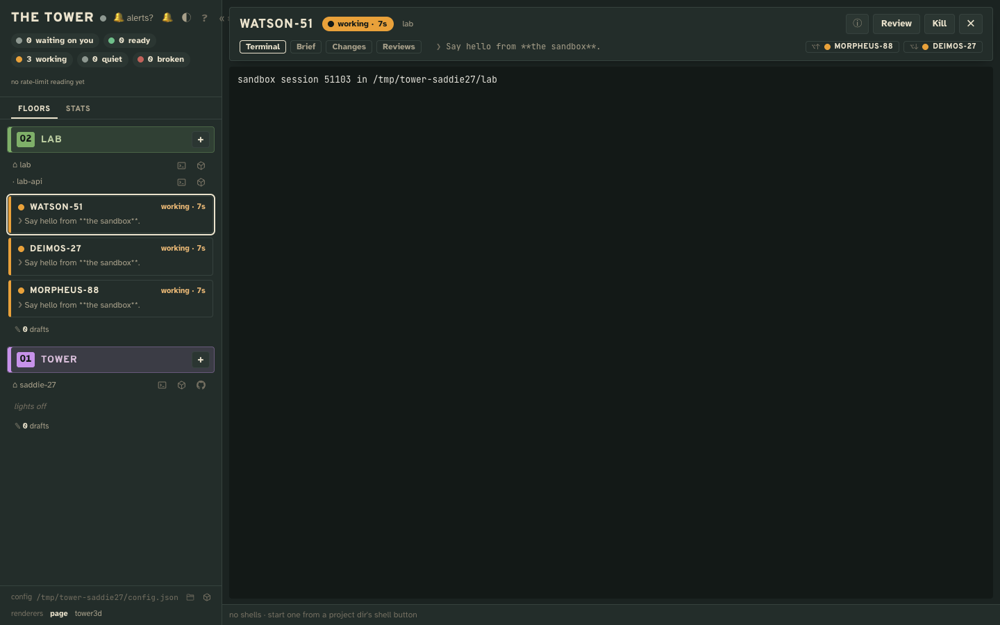
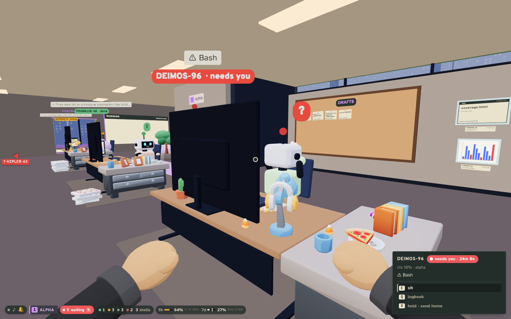

# The tower

A local-first surface for managing many Claude Code sessions. Each session runs the full Claude Code TUI in a
real PTY, owned by a detached host that appends everything about it to a log. Everything a view shows is
derived from those logs, so renderers are swappable: today the tower page, Tower 3D and the `tower` command.

A personal experiment, in daily use. Local only: no accounts, no external services. macOS (it reads `ps -E`,
`lsof` and launchd re-parenting).

No guarantee it keeps working: it drives Claude Code's TUI, hooks and mods, and a future Claude Code version may
break it. The point of the project is its primitives and disposable renderers, for you to shape to your liking. It
doesn't try to solve everyone's problems or to design specific workflows.

Two views of the same data ship with it: the tower page and Tower 3D, a first-person office where every worker
has a desk. Both read the same board and drive the same API, and so can a renderer of your own.




## Requirements

- macOS
- Node ≥ 24
- Claude Code 2.1.292 or later, signed in (tested up to 2.1.294; `tower doctor` and the board say when yours is outside that range)
- `git` and `curl` (Xcode's command line tools)
- Optional: VS Code's `code` on the PATH, or another editor set in the config, to open projects and files from the tower

## Run

```sh
git clone https://github.com/RegiByte/the-tower.git tower && cd tower
npm run setup        # install, write a first config, check the machine, start everything
open http://127.0.0.1:4317
```

`npm run setup -- <dir> [repos...]` makes `<dir>` the first project in place of this checkout; `--tower3d` also
builds Tower 3D (`npm run tower3d` any time later, then open `/r/tower3d/`).

`npm link` puts the `tower` command on your PATH (it is also on the PATH of every session the tower runs):

```sh
tower up | down [host|terms|tower]   # start or stop the host, the terms daemon and the tower, detached
tower doctor                         # check what the tower needs, with a fix for each failure
tower config check                   # check the config as the tower reads it, each problem at its key
tower update                         # move to the newest release, restart the tower, say if the host needs a restart
tower init [hub] [repos...]          # write a first config, never over one
tower spawn <project> [--cwd <dir>] [--model <m>] [--effort <e>] [-- <prompt>]
tower ls | live | ps | reap [id] | resume <id> | submit <id> <text> | kill <id> | screen <id> [t] | attach <id>
```

The host owns every session and the terms daemon every shell: stopping either ends them (sessions can be resumed).
The tower is only a view of them, restarted freely with `tower down tower && tower up tower`. Releases are tags
`vX.Y.Z`, each with an entry in `CHANGELOG.md` saying what it asks of you.

## Use

Talk to your workers: "show me the page you built", "hire a worker for the flaky tests", "check on HOLMES-42",
"get yourself reviewed when you're done", "keep that idea as a draft". [docs/usage.md](docs/usage.md) walks through
what the tower makes possible: showing, hiring, checking on workers, review threads, collections, the shelf and
renderers of your own.

## Config

`~/.tower/config.json` (`TOWER_CONFIG` points elsewhere; its directory is the system root, where logs and sockets
live). `tower init` writes the smallest one; this is it with more of what a project can have:

```json
{
  "argv": ["claude"],
  "env": {},
  "port": 4317,
  "user": { "name": "Your Name" },
  "collections": {
    "drafts": { "label": "Drafts", "description": "Prompts kept for later: each starts a new session or is typed into a worker, then is deleted." },
    "reviews": { "label": "Reviews", "description": "One review thread per checkout, written only with `tower note`: not a place for write-ups." }
  },
  "projects": {
    "my-app": {
      "name": "my-app",
      "hub": "/abs/path/to/my-app",
      "repos": ["/abs/path/to/my-app-api"],
      "color": "#c792ea",
      "shelf": [{ "label": "Notes", "md": "notes/*.md" }],
      "collections": {
        "games": { "label": "Games", "description": "Games played in Tower 3D's arcade: one self-contained .html file each, kept with `tower keep games <file>.html`." }
      }
    }
  }
}
```

A project's sessions start in its `hub`; its `repos` are added with `--add-dir`. The `shelf` keeps pages beside
its sessions. `collections` are sets of files the project keeps for later, every project's at the top level and a
project's own under it; each `description` says what its collection is for, to the user and to every worker.
`port` is where the tower serves (`http://127.0.0.1:<port>`): set another when 4317 is taken, then `tower down` and
`tower up`. Every
key the config takes is in [`docs/config.md`](docs/config.md); `tower config check` checks an edit, each problem at
its key.

## Develop

```sh
npm run typecheck
npm test        # replays recorded session logs (test/fixtures) through the bridge
```

- `AGENTS.md`: architecture, data and code rules.
- `kb/`: the knowledge base, a working theory of the system (systems, flows, decisions, terms) backed by refs
  into the code. Render it with `node .claude/skills/kb/tool/kb.mjs render` and open `kb/dist/tower.html`.

## License

MIT (`LICENSE`). Tower 3D's models are from Kay Lousberg's KayKit Bits (CC0); the fonts and libraries it ships
with keep their own licenses: `THIRD_PARTY.md`.
