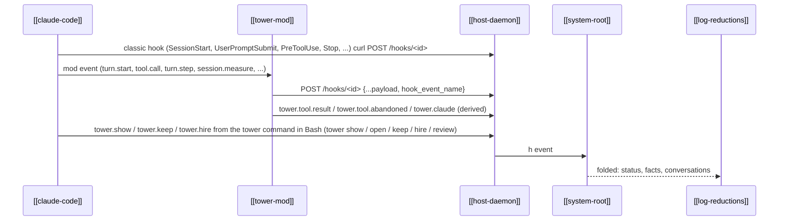

---
{
  "type": "flow",
  "name": "Hook events",
  "summary": "How what Claude does inside a session reaches its log: classic hooks over curl and mod events over fetch, both declared by the tower mod, both into the host's hooks socket.",
  "in": "tower",
  "reviewed": "2026-10-08",
  "involves": ["claude-code", "tower-mod", "host-daemon", "system-root", "log-reductions"],
  "refs": ["hub/src/mod/hooks/hooks.json", "hub/src/mod/hooks/register.js#forward", "hub/src/host/main.ts#hooks", "hub/src/bridge/status.ts#HOOK_STATUS", "hub/src/bridge/blocked.ts#blockedBy"]
}
---

- **Declared by the mod.** The plugin's [`hooks.json`](ref:hub/src/mod/hooks/hooks.json) lists the classic
  events and the curl that posts each, beside the mod's modules. Each Claude reads it as it starts, so changing
  the list needs no host restart: sessions started after the change follow it.
- **Addressing.** The host passes `TOWER_SESSION_ID` and `TOWER_HOOKS_SOCKET` in each session's env; both
  transports post to `/hooks/<TOWER_SESSION_ID>` on that socket.
- **Before the first hook.** Claude raises no hook while a startup screen holds it (workspace trust, first-run
  setup, sign-in): until the first status hook, the fold reads the session's output for those screens instead
  ([`blockedBy`](ref:hub/src/bridge/blocked.ts#blockedBy)), and the session is `blocked` ([[attention-list]]). The trust dialog comes
  before the mod's `session.start` and Claude's `SessionStart` (`test/fixtures/trust-dialog.jsonl`).
- **Order.** Claude awaits each hook, and the mod awaits each post, so `h` events land in the order Claude
  raised them. Status depends on that order.
- **Who decides what.** Classic hooks decide most status transitions
  ([`HOOK_STATUS`](ref:hub/src/bridge/status.ts#HOOK_STATUS)); the mod's `turn.complete` decides
  interrupts and failures, its `turn.step` carries model, effort and the text Claude showed the user that
  step, and its `session.measure` carries context, cost and rate limits. Claude's conversation id comes only from classic hooks (`session_id`).
- **Failure.** A post that fails makes the hook exit non-zero; Claude reports it without blocking the
  session. A post for a session the host does not run gets 404.
