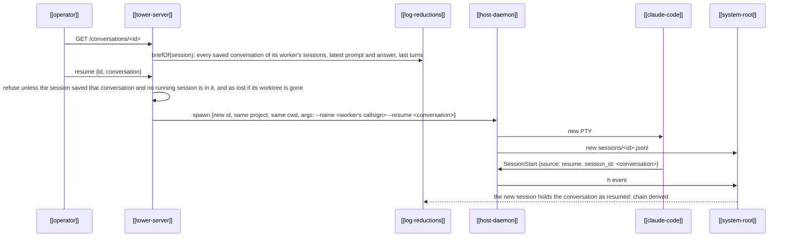

---
{
  "type": "flow",
  "name": "Resume",
  "summary": "A new session continues one of the conversations an earlier session saved; which session resumes which is derived from Claude's session_id, never stored.",
  "in": "tower",
  "reviewed": "2026-10-09",
  "involves": ["operator", "tower-server", "host-daemon", "claude-code", "system-root", "log-reductions"],
  "refs": ["hub/src/shared/launch.ts#resumeRequest", "hub/src/tower/server.ts#resume", "hub/src/tower/server.ts#resumeOnce", "hub/src/cli.ts#resumeThroughTower", "hub/src/cli.ts#resumeAtHost", "hub/src/bridge/chains.ts#heldBy", "hub/src/bridge/chains.ts#runsAs", "hub/src/system.ts#watchSystem", "hub/src/bridge/board.ts#checkoutGone", "hub/src/bridge/conversation.ts#conversationsAfter", "hub/src/bridge/chains.ts#resumes", "hub/src/bridge/chains.ts#resumedBy", "hub/src/bridge/chains.ts#continues", "hub/src/bridge/chains.ts#lineage", "hub/src/bridge/chains.ts#resumeName", "hub/src/worktrees.ts#briefFor", "hub/src/bridge/board.ts#unresumableAt", "hub/src/shared/cards.ts#UNRESUMABLE_NAME"]
}
---

- **A session is a worker; a conversation is Claude's.** A session holds one or more [[conversation]]s, a
  new one after each `/clear`. Only a saved one (it got a prompt, or was itself resumed) can be resumed.
- **One Claude per conversation.** A resume is refused while a running session is already in the conversation
  ([`heldBy`](ref:hub/src/bridge/chains.ts#heldBy)): its latest conversation, or, before Claude reports one, the one
  its header's argv resumes, so a resume holds its conversation from the moment the host starts it. The refusal names
  the holder by the name its Claude runs under ([`runsAs`](ref:hub/src/bridge/chains.ts#runsAs)). The tower runs
  resumes one at a time ([`resume`](ref:hub/src/tower/server.ts#resume)), each until the system holds the session it
  started, so two requests at once start one session. `tower resume` asks the same queue through `POST /resume` while the tower runs ([`resumeThroughTower`](ref:hub/src/cli.ts#resumeThroughTower)); with no tower up it asks the host directly ([`resumeAtHost`](ref:hub/src/cli.ts#resumeAtHost)), refusing a conversation any session already started is in. Resuming a conversation
  a running session has left (by `/clear`) still forks.
- **Same directory.** Claude files conversations by directory, so the resume runs in the source's `cwd`
  under the same project ([`resumeRequest`](ref:hub/src/shared/launch.ts#resumeRequest)). In a [[worktree]] the
  directories follow from `cwd` and the worktree line of the system prompt is composed again, with the branch read
  from git then ([`briefFor`](ref:hub/src/worktrees.ts#briefFor)). If any of its folders is gone, the resume is
  refused as `lost` until the worktree is recut. A fork resumes in the same `cwd`, so it shares its parent's worktree.
- **Whether it can be resumed is on the board, before the click.** A worker not running whose `cwd` is no longer a
  dir of its floor or a worktree of one (`inProject`: the hub moved, or the project left the config) is
  `unresumable: 'outside'`; one whose worktree git no longer lists with its folder in every repo of the project
  (removed by Tidy, deleted, or lost: the same folders the tower's resume refuses as `lost` without) is `'gone'` ([`unresumableAt`](ref:hub/src/bridge/board.ts#unresumableAt), from the config and git's reads,
  nothing until the floor's git is read once; the same [`checkoutGone`](ref:hub/src/bridge/board.ts#checkoutGone) is
  `card.worktree.gone`, live or not, which withholds the card's `review`: it would fork that checkout). Only a card holding a conversation nobody resumed says so; it and its conversations offer no `resume`, a stranded one is
  not on duty, and every renderer and `tower agent` say why in a word or two
  ([`UNRESUMABLE_NAME`](ref:hub/src/shared/cards.ts#UNRESUMABLE_NAME)). A recut worktree makes it resumable again.
- **The chain is derived.** [`resumes`](ref:hub/src/bridge/chains.ts#resumes) links a resumed conversation
  to the nearest earlier session that saved it; [`resumedBy`](ref:hub/src/bridge/chains.ts#resumedBy) to the
  nearest later one that resumed it. A conversation resumed twice from one session forks; each link is to the
  nearest session in time, and names it with its worker's callsign and start (`{id, callsign, startedAt}`, a [`SessionLink`](ref:hub/src/bridge/chains.ts#SessionLink)) on the board
  and in the brief, so no reader looks the session up.
- **What carries over.** A resumed session that has no prompt or answer yet shows its source's. A worker's brief
  holds the conversations of every session it ran as, the earlier ones folded ([[brief-turns]]), and `card.lineage`
  lists those sessions.
- **Same worker, or a fork.** A session whose first conversation resumes its source's latest saved one
  [`continues`](ref:hub/src/bridge/chains.ts#continues) it: the board gives it the source's [[callsign]] and
  showings ([[agent-show]]), and the source's card names it `continuedBy` (`{id, callsign}`). A resume of an earlier conversation
  (one before a `/clear`) forks a new worker. The resume runs Claude under the name that follows
  ([`resumeName`](ref:hub/src/bridge/chains.ts#resumeName)), so its peer name stays the callsign.
- **Mid-turn cut-offs** resume idle: the user says "continue". `tower resume <id>` resumes the latest saved
  conversation.
