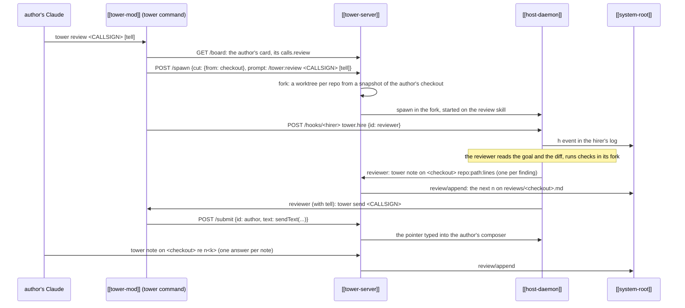

---
{
  "type": "flow",
  "name": "Review round",
  "summary": "One review end to end: a worker (or the user) hires a reviewer in a fork of the author's checkout, the reviewer leaves notes on the checkout's thread, delivers a pointer to them, and the author answers each note on the same thread.",
  "in": "tower",
  "reviewed": "2026-10-08",
  "involves": ["tower-mod", "tower-server", "host-daemon", "system-root"],
  "refs": ["hub/src/directory.ts#cardNamed", "hub/src/directory.ts#postToHost", "hub/src/directory.ts#readThread", "hub/src/bridge/verbs.ts#cardOffers", "hub/src/shared/reviews.ts#reviewPrompt", "hub/src/shared/reviews.ts#reviewedIn", "hub/src/shared/reviews.ts#sendText", "hub/src/shared/reviews.ts#unseenBy", "hub/src/tower/server.ts#spawnCut", "hub/src/tower/server.ts#appendReview", "hub/src/worktrees.ts#fork", "hub/src/worktrees.ts#snapshot", "hub/src/mod/skills/review/SKILL.md"]
}
---

- **Who starts it.** Any worker with `tower review <CALLSIGN>`, or the user from the card's `review` verb. The
  card offers `review` only when the worker has a conversation, is no reviewer itself and every dir of its floor
  is a git repo ([`cardOffers`](ref:hub/src/bridge/verbs.ts#cardOffers)). The card's own call is a `spawn` with
  `cut.from` and no `tell`: the reviewer's notes then wait on the thread for the user, who sends them from the
  Reviews panel. `tower review ... tell` swaps the prompt for one that makes the reviewer send them itself. The
  tower command finds the author on the board, else in the floors' archives
  ([`cardNamed`](ref:hub/src/directory.ts#cardNamed), [[board-archive]]).
- **The fork.** [`fork`](ref:hub/src/worktrees.ts#fork) starts each repo of a new worktree from a
  [`snapshot`](ref:hub/src/worktrees.ts#snapshot) of the author's checkout: its HEAD with staged, unstaged and
  untracked files on top, built in a copy of the index so the author's checkout is never touched. The fork's
  Changes count from the base the author's did, so the reviewer sees what the user sees. A failed spawn rolls the
  cut back ([`spawnCut`](ref:hub/src/tower/server.ts#spawnCut)).
- **The pair is derived.** The reviewer's first prompt starts with the review skill and the author's callsign
  ([`reviewedIn`](ref:hub/src/shared/reviews.ts#reviewedIn)); `card.reviews` and the thread a reviewer writes on
  (its author's checkout) come from that, nothing is stored. The hire itself is a fact: [[hire]] covers
  `tower.hire`, and `tower review` posts it too but is never refused by the hiring limits ([[hiring-limits]]).
- **The thread is a file.** Notes are appended only through `review/append`, read, numbered and written in one
  synchronous step so concurrent appends from the page and from workers never interleave
  ([`appendReview`](ref:hub/src/tower/server.ts#appendReview)). A note may quote the lines it is about, read from
  the checkout's copy of the repo. See [[review-threads]].
- **Delivery is a submit.** [`sendText`](ref:hub/src/shared/reviews.ts#sendText) is one line naming the notes
  new to the target ([`unseenBy`](ref:hub/src/shared/reviews.ts#unseenBy)) and how to read and answer them; it
  is typed into the author's composer, so the author must be at it (the card's `submit` call).
- **One round.** The reviewer stops after delivering; a re-review is a new hire. The author answers with
  `tower note on <checkout> re n<k>`: "fixed" is a reply, there are no statuses. See [[reviewer]]. The reviewer
  reports to its author, so sending the author home sends it too ([[crews]]); once the checkout's work lands,
  [[tidy]] files the thread as `<checkout>@<YYYY-MM-DD-HHMM>.md` and the checkout starts a fresh one.
- **Failure.** `tower review` fails when the card offers no review, when the tower is down, or when the worker
  was not started by the tower (no `TOWER_SESSION_ID` or `TOWER_HOOKS_SOCKET`).
