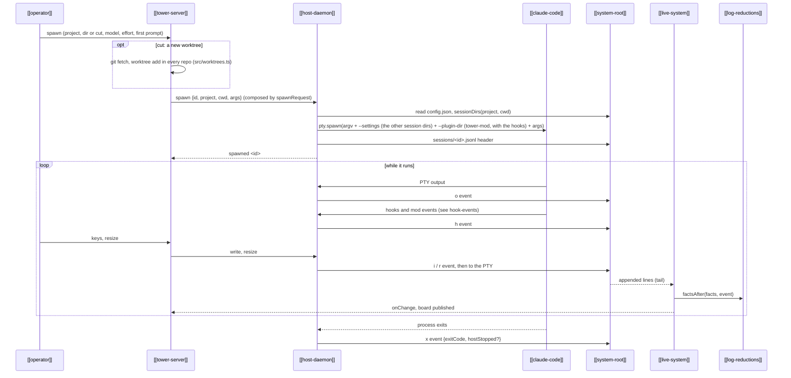

---
{
  "type": "flow",
  "name": "Session lifecycle",
  "summary": "One Claude session end to end: a renderer asks for it, the host runs it in a PTY and logs everything, and every renderer derives what to show from that log.",
  "in": "tower",
  "reviewed": "2026-10-08",
  "involves": ["operator", "tower-server", "host-daemon", "claude-code", "system-root", "live-system", "log-reductions"],
  "refs": ["hub/src/shared/launch.ts#spawnRequest", "hub/src/host/main.ts#spawnSession", "hub/src/host/session.ts#sessionEnv", "hub/src/system.ts#watchSystem", "hub/src/bridge/facts.ts#factsAfter", "hub/src/tower/server.ts#streamScreen", "hub/src/shared/model.ts#sessionDirs", "hub/src/tower/server.ts#spawnCut"]
}
---

- **Triggers.** The tower's spawn dialog, or `tower spawn`. Both build the request with
  [`spawnRequest`](ref:hub/src/shared/launch.ts#spawnRequest), which mints the session id and names Claude by its
  [[callsign]]; the host adds only its own wiring
  ([`sessionArgv`](ref:hub/src/host/session.ts#sessionArgv)).
- **Where.** A session starts in a main checkout (`spawn {cwd}`, the hub's when `cwd` is left out), in a [[worktree]]
  the floor already has, or in a new one: `spawn {cut}`, never with a `cwd`, cuts the same name in every repo first, then starts the worker in the hub's worktree, and rolls the cut
  back if the spawn fails ([`spawnCut`](ref:hub/src/tower/server.ts#spawnCut)). The host accepts a `cwd` only through
  [`sessionDirs`](ref:hub/src/shared/model.ts#sessionDirs), which also gives the other directories the session may
  read; a worktree whose folder is gone in any repo is refused as `lost` ([[tower-cuts-worktrees]]).
- **The log is written before anything else sees it.** Input and resizes are appended before they
  reach the PTY. A renderer never talks to Claude; it reads the log and asks the host.
- **The screen is replayed, not stored.** Opening a session rebuilds its screen from the `o` and `r`
  events ([`snapshot`](ref:hub/src/bridge/screen.ts#snapshot)), then streams appended output. The log is read for
  those alone ([`screenEvents`](ref:hub/src/tail.ts#screenEvents)): no other line is parsed.
- **End.** The PTY exits by itself, by `kill`, or because the host stopped (`hostStopped`). A session with
  no `x` whose host is gone shows as `lost`. Either way it can be resumed: a resume is a new session
  continuing the same Claude conversation.
- **Renderers restart freely.** The tower or `tower` can die mid-session; the host keeps the PTY and the log,
  and the next renderer folds the log again ([[host-owns-ptys]]), from the checkpoint the last fold left
  ([[fold-checkpoints]]).
