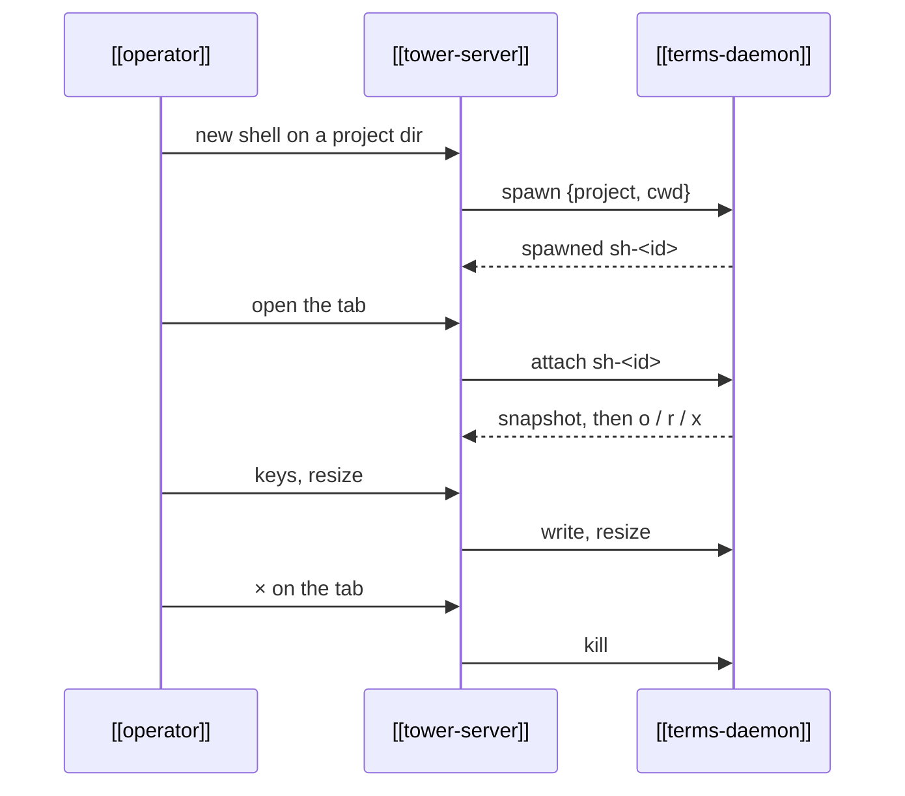

---
{
  "type": "flow",
  "name": "Shell session",
  "summary": "A shell opened from the tower in a project directory, watched as a docked tab and kept running across tower restarts.",
  "in": "tower",
  "reviewed": "2026-10-08",
  "involves": ["operator", "tower-server", "terms-daemon"],
  "refs": ["hub/src/terms/main.ts#spawnShell", "hub/src/terms/main.ts#attach", "hub/src/tower/server.ts#streamShell"]
}
---

- Keys go through the shared [`terminalKeys`](ref:hub/src/shared/termkeys.ts#terminalKeys), as in every browser
  terminal: the Mac editing keys (⌘⌫, ⌘←, Shift+Enter, …) become the readline keys a shell reads
  ([[renderer-shared-modules]]).
- Collapsing a tab only closes the stream; the shell keeps running.
- Two viewers of one shell fight over its size: the last to fit wins.
- Nothing is logged. A terms daemon restart ends every shell.
