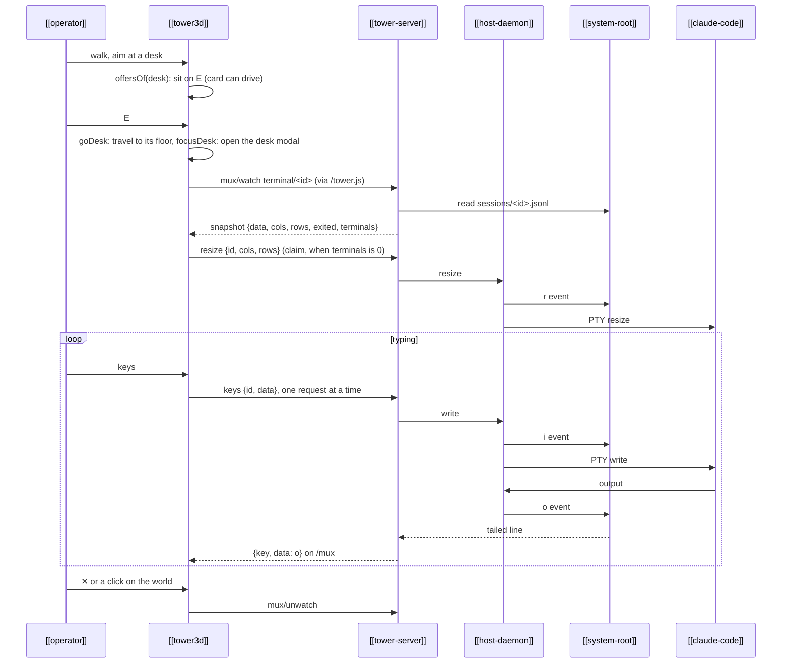

---
{
  "type": "flow",
  "name": "Sitting at a desk in Tower 3D",
  "summary": "In Tower 3D you aim at a worker's desk and press E: the desk panel opens as a modal over the world, the session's real terminal opens on its terminal stream and claims the PTY size unless another terminal is open on the session, and every key you type reaches the host in order.",
  "in": "web-tower",
  "reviewed": "2026-10-08",
  "involves": ["operator", "tower3d", "tower-server", "host-daemon", "claude-code", "system-root"],
  "refs": ["hub/renderers/tower3d/src/acts.ts#offersOf", "hub/renderers/tower3d/src/main.ts#onKey", "hub/renderers/tower3d/src/main.ts#RUN", "hub/renderers/tower3d/src/main.ts#goDesk", "hub/renderers/tower3d/src/main.ts#focusDesk", "hub/renderers/tower3d/src/term.ts#mountTerm", "hub/src/shared/termkeys.ts#terminalKeymap", "hub/src/tower/tower.js#keySender", "hub/renderers/page/index.html#pageRequests", "hub/src/tower/server.ts#muxWatch", "hub/src/tower/server.ts#screenStream", "hub/src/tower/server.ts#terminalStream", "hub/src/tower/server.ts#command", "hub/renderers/tower3d/src/main.ts#drawChanges", "hub/renderers/tower3d/src/main.ts#mountDeskScreen", "hub/renderers/tower3d/src/main.ts#replay", "hub/renderers/tower3d/src/input.ts#listen", "hub/src/machine.ts#hostRequest", "hub/src/host/main.ts#handle"]
}
---

- **Aim, then E.** What sits under the crosshair offers its verbs on every frame
  ([`offersOf`](ref:hub/renderers/tower3d/src/acts.ts#offersOf)); a desk's `use` is "sit" while its card is live
  ([[verb-prompts]]). E runs it through the act table ([`RUN`](ref:hub/renderers/tower3d/src/main.ts#RUN)):
  [`goDesk`](ref:hub/renderers/tower3d/src/main.ts#goDesk) cuts to the desk's floor if needed, and
  [`focusDesk`](ref:hub/renderers/tower3d/src/main.ts#focusDesk) opens the desk panel: a modal centred over the
  world (`min(94vw, 1500px)` by `min(90vh, 1000px)`), its spread shadow dimming the rest. The camera stays at
  your eyes, and while the modal is open the scene isn't drawn: the canvas keeps its last frame and updates go
  on. A video-wall tile opens the same terminal in place.
- **The transport depends on where Tower 3D runs.** At `/r/tower3d/` `/tower.js` calls the routes and
  opens one `/mux` stream; framed from a shelf in the tower page, it posts to the page, which makes the same requests
  ([`pageRequests`](ref:hub/renderers/page/index.html#pageRequests)). The server parses each command by its schema
  ([`command`](ref:hub/src/tower/server.ts#command)) and relays it to the host over `control.sock`
  ([`hostRequest`](ref:hub/src/machine.ts#hostRequest)) ([[renderer-api]]).
- **Snapshot, then tail.** The screen stream sends the screen rebuilt from the log, then each `o`, `r` and `x`
  the host appends ([`screenStream`](ref:hub/src/tower/server.ts#screenStream)). A session that is no longer
  running sends only its snapshot: the terminal opens read-only, claims nothing and sends no keys.
- **Claimed on open, when it is the only terminal.** One PTY, one size: whoever types owns it. The desk opens the
  `terminal/<id>` stream, the screen stream as an interactive terminal opens it, whose snapshot says how many other
  terminals are open on the session ([`terminalStream`](ref:hub/src/tower/server.ts#terminalStream); a monitor's
  `screen/<id>` stream is not one). With none,
  [`mountTerm`](ref:hub/renderers/tower3d/src/term.ts#mountTerm) fits the terminal to the modal at a 14px font and sends
  `resize` as soon as the snapshot arrives, so typing works at once; beside another (the tower page on the same
  session, another window) it reads "watching" at a font that fits, so opening never reflows the session under
  whoever is working. Typing always claims; focusing does not. A resize from another viewer hands the size back the
  same way. A shell's stream says nothing of other terminals, and a kiosk claims on open.
- **Keys in order.** [`keySender`](ref:hub/src/tower/tower.js#keySender) sends each chunk xterm produces as its
  own `keys` request, the next only after the last answered: Claude reads text and Enter in one write as a paste.
  The Mac editing keys (Shift+Enter a newline, ⌘⌫, ⌘←, …) are sent as readline keys by
  [`terminalKeymap`](ref:hub/src/shared/termkeys.ts#terminalKeymap) ([[renderer-shared-modules]]), at the chords
  `board.keys` binds; the moves and ⌥Esc, which leaves the terminal, run from inside it too ([[keymap]]). The host logs `i` before writing to the PTY
  ([`handle`](ref:hub/src/host/main.ts#handle)).
- **The panel's tabs.** Logbook (its sessions over the lineage brief, [[logbook]]), Changes (the worker's diff:
  [[changes-view]]), Reviews on a floor keeping threads ([[review-threads]]) and each thing the worker showed lie
  over the terminal, which keeps its size; Q (or E on the binder by its keyboard) opens the desk on its Logbook and T
  on its Reviews tab. A past session picked in the Logbook replaces the terminal with that session's last screen
  (`screen/<session>`, read-only, sepia under a REPLAY stamp) until ● live or Esc mounts the terminal again
  ([`mountDeskScreen`](ref:hub/renderers/tower3d/src/main.ts#mountDeskScreen)); Esc then goes back to Claude. Changes and Reviews are the shared panels ([[shared-panels]]),
  drawn by [`drawChanges`](ref:hub/renderers/tower3d/src/main.ts#drawChanges) and
  [`drawThread`](ref:hub/renderers/tower3d/src/main.ts#drawThread), and worked with the mouse: fold, Viewed, a click on a
  line number picks it (⇧ extends) and opens a note box under it, an anchor scrolls Changes to its line. While a
  text box has focus, keys type into it and never move you.
- **Leaving.** Esc belongs to Claude, so the panel closes with ✕ or a click on the dimmed world around it; closing unwatches the
  stream, and the session keeps running.
